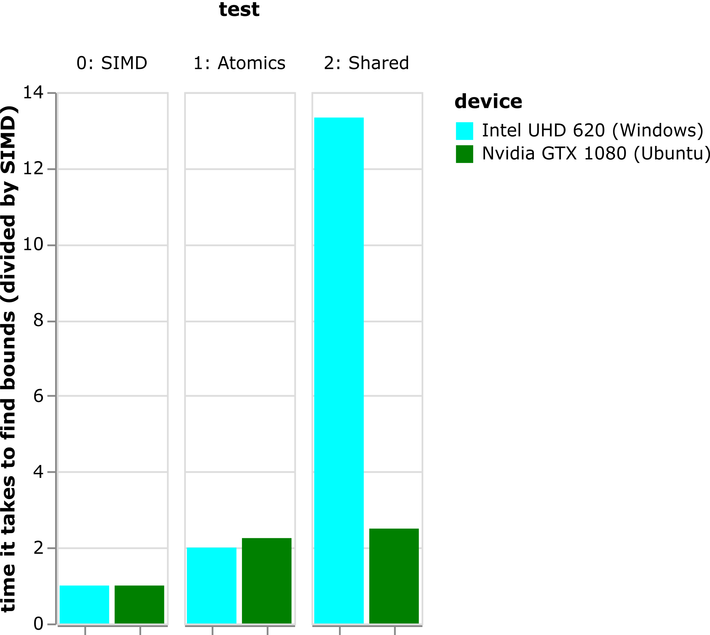

# WebGPU Simdgroup 20200828

This repository contains annotations, samples, and slides for the Machine Learning Workshop session hosted in 2020 09.


## Cloning

Clone with submodules:
```
git clone --recurse-submodules https://github.com/mehmetoguzderin/webgpu-20200828-simdgroup
```


## Building

Please check out respective folders for the build instructions.


## Comparison

Data built on the samples shows that SIMD is at least 2x **faster** than other methods.


